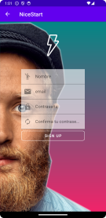
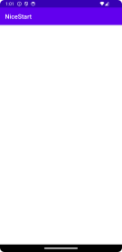

## Este es mi primer gran proyecto en Android Estudio

Vamos a trabajar en este proyecto a lo largo del curso.


Ahora mismo el proyecto consta de:
1. Un Activity Login
2. Un Activity Register
3. Un Main Activity

Los cuales hemos desarrollado en un par de semanas.


Vamos a tener nuestro ***XML*** el cual nos permitió dar un formato a la ventena, mientras que en el ***.java*** pudimos darle funcionalidad a los botones

```JAVA
public class Login extends AppCompatActivity {

    @Override
    protected void onCreate(Bundle savedInstanceState) {
        super.onCreate(savedInstanceState);
        setContentView(R.layout.activity_login);
    }

    public void openMain(View v) {
        Intent intent = new Intent(Login.this, MainActivity.class);
        intent.addFlags(Intent.FLAG_ACTIVITY_NEW_TASK);
        intent.addFlags(Intent.FLAG_ACTIVITY_CLEAR_TASK);
        startActivity(intent);
    }

    public void openRegister(View v) {
        Intent intent = new Intent(Login.this, Register.class);
        startActivity(intent);
    }

}
```
Esto nos permite crear los ***Intent*** necesarios para poder dar funcionalidad a la applicación.




Lo que diferencia esta ventana de la anterior es el **Action Bar** superior el cual nos permite volver a la ventana de *Login* pulsando en la flecha.

En caso de pulsar en *Sign Up* nos mandaria al *Main Activity*.



Como sucedía en el *Register* tenemos un **Action Bar** en la parte superior pero con la vista en blanco. A la hora de utilizar las **Flags** esto nos permite no tener que volver a la pantalla de *Login*.

Seguid atentos para nuevas actualizaciones :octocat:.

> [!NOTE]
> Práctica de Desarrolo de Interfaces, DAM 2º. IES Juan de la Cierva.
