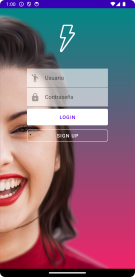

# Este es mi primer gran proyecto en Android Estudio

Vamos a trabajar en este proyecto a lo largo del curso.


El proyecto consta de:
1. Un Activity Launcher.
2. Un Activity Login.
3. Un Activity Register.
4. Un Activity Main.
5. Un Activity Refresh

### Activity Launcher


Esta vista se muestra en primera instancia con un color sólido, que se va desvaneciendo y da paso a un fondo que va a ser una imagen cargada con *Glide* y aparecera una animacion de tipo *Zoom_in* en la parte inferior de la vista.

Despuede de unos segundo se dara paso a la vista de ***activity_login***.

```JAVA
public class Splash extends AppCompatActivity {

    @Override
    protected void onCreate(Bundle savedInstanceState) {
        super.onCreate(savedInstanceState);
        setContentView(R.layout.activity_splash);
        //Declaramos la imagen de fondo
        ImageView photoSplash = findViewById(R.id.fondoSplash);
        Glide.with(this)
                //Cargamos con la URL
                .load("url de la imagen")
                //Transicion mientras se puede obtener la imagen con la URL
                .transition(DrawableTransitionOptions.withCrossFade(2000))
                //Que se va a mostrar hasta que se cargue la imagen
                .placeholder(new ColorDrawable(this.getResources().getColor(R.color.fucsia_200)))
                //Centra la foto y recorta los bordes
                .centerCrop()
                //La guardamos en cache
                .diskCacheStrategy(DiskCacheStrategy.ALL)
                //Insrta la foto en mi ImageView
                .into(photoSplash);
        ImageView icono = findViewById(R.id.icono);
        Animation animation  = AnimationUtils.loadAnimation(
                this, R.anim.animacion_zoom_in);
        icono.startAnimation(animation);
        //Lanzamos a la otra aplicacion con esta funcion
        openApp();
    }
    
}
```

### Activity Login


En esta pantalla se muestra un campo para introducir un *Usuario* y una *Contraseña* y dos botones diferentes que nos llevaran a la vista ***activity_main*** y a la vista ***activity_login*** respectivamente.

Para unir las vistas lo realizamos de la siguiente forma en el ***Login.java***.
```JAVA
public class Login extends AppCompatActivity {

    @Override
    protected void onCreate(Bundle savedInstanceState) {
        super.onCreate(savedInstanceState);
        setContentView(R.layout.activity_login);
    }

    public void openMain(View v) {
        Intent intent = new Intent(Login.this, MainActivity.class);
        intent.addFlags(Intent.FLAG_ACTIVITY_NEW_TASK);
        intent.addFlags(Intent.FLAG_ACTIVITY_CLEAR_TASK);
        startActivity(intent);
    }

    public void openRegister(View v) {
        Intent intent = new Intent(Login.this, Register.class);
        startActivity(intent);
    }

}
```
Esto nos permite crear los ***Intent*** necesarios para poder dar funcionalidad a la applicación.

### Activity Login


En esta pantalla se encuentran los campos necesarios para realizar el registro de un neuvo usuario en la aplicación, el boton de **Sing Up** nos llevara a la vista del ***activity_main***.

Lo que diferencia esta ventana de la anterior es el **Action Bar** superior el cual nos permite volver a la ventana de ***activity_login*** pulsando en la flecha.

### Activity Main


En esta vista tenemos una **ScrollView** la cual nos permite navegar entre los diferentes contactos que tenemos, ademas de incluir un **FloatButton** sobre un **BottomAppBar**.

Como sucedía en el ***activity_register*** tenemos un **Action Bar** en la parte superior, pero esta no cuenta con la flecha de retroceso.

### Activity Refresh


En esta vista se muestra un **WebView** en la cual si refrescamos la vista cambiará generando otra imagen diferente y mostrando un **Toast** con un mensaje indicando que la persona que aparece no existe.

Se ha trabajado tambien con **PullRequest**, realicé uno a mi compañero [Nacho](https://github.com/Nachiitoo3/AroundGitFinal/network) como se puede ver en su **Network graph** y además el realizo otro en [mi proyecto](https://github.com/CarlotaCordero/NiceStart/network). Ambos realizamos animaciones nuevas para el proyecto del otro.

<iframe src="img\videoUso.webm" width="200px" height="200px"></iframe>

Seguid atentos para nuevas actualizaciones :octocat:.

> [!NOTE]
> Práctica de Desarrolo de Interfaces, DAM 2º. IES Juan de la Cierva.
